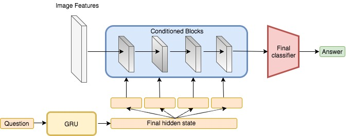
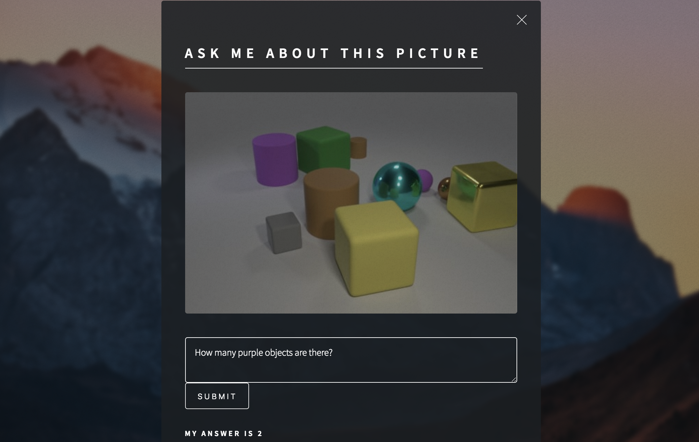
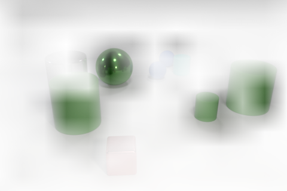
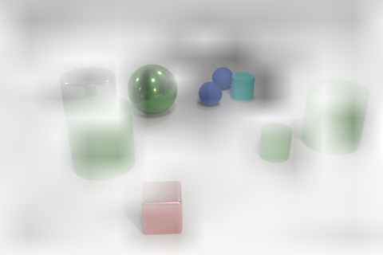
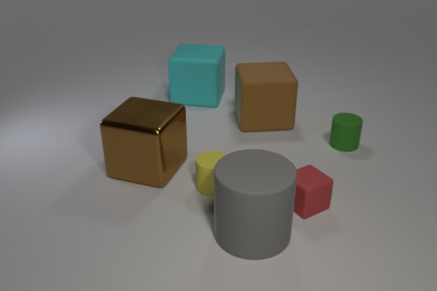

# Visually reasoning AI

#### Eugene Koran capstone project (presented at Galvanize Nov,2 2017)


[](www.visuallyreasoningai.com)

Motivation for this project was the fact that neural networks are pretty good at
recognizing objects, they can really distinguish cats from dogs, but what we really want them to do is to understand visual information and to be able to reason about it.

Look at this picture.

**Are there more balls than green things?**


To answer to this simple question you need to know a lot about this world. You need to recognize colors and shapes, be able to count and compare. Traditional neural networks will have hard time
trying to answer to this question.

Source of this image is [CLEVR dataset](http://cs.stanford.edu/people/jcjohns/clevr/). It is a diagnostic dataset created to facilitate development of artificial intelligence systems that can reason and answer questions about visual data. It consists of 100.000 images with 10 logical questions attached to each image. Dataset was built in a way that over 835.000 questions are unique.

In images objects exist in 6 possible colors, 4 possible shapes and 2 materials: metal and rubber.

I was inspired by this research:

[FiLM: Visual Reasoning with a General Conditioning Layer (2017)](https://arxiv.org/abs/1709.07871)

This paper introduced new method for conditioning network architecture and got state-of-the-art result for CLEVR dataset. I decided to build this model, experiment with it and try to get even better results.

## Model

I have built my model in Python using Pytorch framework. On a high level architecture of the model looks like this:



It consists of two neural networks. Gated Recurrent Unit network (GRU) processes a question and its final hidden state is used as a conditional input to the Convolutional Neural Network, which takes image features and processes it through several (4 in this case) conditional blocks. Image features then are processed by final classifier that outputs a softmax distribution over 32 possible final answers.

In my experiments I tried to use different number of conditional blocks and tried different feature extractors to get more useful representation of image features.

When I had built the model for the first time it turned out that the model needed around 72 hours of training to converge. To speed-up training I parallelized training of a single model with multiple GPUs and used varying learning rate. In the end I was able to speeded-up training of a single model up to 50%. Also I used large EC2 instance with 8 GPUs which allowed me to run several experiments at a time.

It turned out that the model architecture was pretty robust to the changes that I was doing and different variations of the model landed up with validation accuracy between 96 and 97 percent.

## Web Application
At this point I started to play with trained models and I found it to be really enjoyable. So I used Flask, ajax, HTML and JavaScript to build a web application for answering user-input questions.

[](www.visuallyreasoningai.com)

###### Example questions you can ask my model:

- How many things are there?
- How many small yellow cylinders are there?
- Is there an equal number of brown matte objects and shiny spheres?
- Are there fewer small rubber cubes in front of the cyan ball than purple cylinders?
- What number of other objects are there of the same shape as the large green object?
- How big is the gray rubber object that is behind the big shiny thing behind the big metallic thing that is on the left side of the purple ball?

The model takes in any user input, but misspellings and unknown words are not used in producing answers.

Albeit the fact that the model required lots of time to be trained, it is producing answers pretty fast and you can play with it in real time.  App is available at  [visuallyreasoningai.com](www.visuallyreasoningai.com).

## Vizualization

To visualize, what my model learns, I took out the activations of the last convolutional layer and average them over all the feature maps to obtain a single feature map. I upscaled this map to the size of the original image and put it on top of it as an additional layer. In this way I got this images:

**Question:** Are there more balls than green things?
**Answer:** No


**Question:** What is the color of the object closest to the blue cylinders?
**Answer:** Cyan


From this images you can see that the model was able to identify the areas of the image that are the
most important for answering this specific questions. Highlighted areas mean that the activations inside the model, corresponding to these areas, had the largest values.

## Limitations

The model achieves 97% accuracy for the validation set but the model is biased to the types of questions that it was trained on. The model was trained on difficult multilayered questions to facilitate visual reasoning. The downside of it is that the model may fail on some simple questions that were underrepresented in the training data. Limitations of the model are:

1. The model tends to produce wrong answers when it needs to count large number of objects. Generally counting of more then 5 objects is a problem. Nevertheless I have never seen the model being wrong by more than 1 item.

2. The model is biased to answering 'yes' more often than 'no' and to producing greater than zero answers for counting questions. Here is nice example of it:

   **Question:** How many yellow __spheres__ are there?
   **Answer:** 1 (Correct answer: 0)

   **Question:** How many yellow __cylinders__ are there? **Answer:** 1


   In the same way if you ask the model, if there `a yellow sphere / a yellow cylinder` in the image, you will get an answer 'yes' in both cases. What is interesting, if you ask the model about the shape of the yellow object, it will recognize a cylinder. The model uses visual information to produce an answer but, if there is any ambiguity, it tries to guess using its prior knowledge of the questions it was asked before. The model is like a kid, who knows all the colors and able to count, but is relatively easy to trick by the authority of adults.

   Also it is interesting that the model is completely inconsistent in its answers. I think enforcing consistency could greatly improve the performance of the model for user-input questions.

3. The model tends to make errors on questions related to partially-occluded objects. This limitation is expected and is closely related to previous point.

## Future work

Interesting venues for future work for this project are:

1. Rights now, when the model faces unknown word, it replaces it with a special tag that doesn't help the model to produce an answer. It would be interesting to try to use word2wec to encode unknown words. I could use cosine similarity to find a word in the model vocabulary that is the most similar to the unknown word. Then I could encode this unknown word with the most similar word in the vocabulary. I think this would increase performance of the model in answering user-input questions.

2. One of the main bottlenecks of this project was the time of training. Few days before the end of the project Amazon introduced new EC2 instances with the latest GPU architecture that was advertised to be much faster than the previous generation. It would be interesting to train the model with one of this new machines. Having ability to test more ideas and get fast response could be really valuable.

3. It would be interesting to explore applications of this model to different business problems. Similar model could be applied to different problem where you have the images of objects in certain limited conditions (for example images of apparel on the white background).

   With respect to this problem you can train the model to answer different questions, for example to identify colors present in the image. Then you can use this information to allow users to search items with a specific color, even when this color is not the most dominant color of the item. You can use similar approach to search for items with some style features like a specific sleeve or a checkered pattern.  

   I would like to admit that conditioning of image features in this project was done with text input, but it doesn't necessarily need to be done with text. Conditioning method is very general. You can use any input for conditioning and it would be exciting to try to condition images on the other images. Interesting idea is to try to use images of raw color patterns as a conditioning input to apparel images.

Thanks for reading!

## Instructions

Code was developed in Python 3.6. Training run on AWS p2.xlarge instance.

1. Install Pytorch
```
sudo pip3 install http://download.pytorch.org/whl/cu80/torch-0.2.0.post3-cp36-cp36m-manylinux1_x86_64.whl
```

2. Download and unpack the data (unpacked data takes 20Gb)
```
mkdir data
wget https://s3-us-west-1.amazonaws.com/clevr/CLEVR_v1.0.zip -O data/CLEVR_v1.0.zip
unzip data/CLEVR_v1.0.zip -d data
```
3. Preprocess the data (preprocessed data takes 63Gb). Preprocessed image features and questions are saved as h5 datasets to `/data` folder.
```
sh preprocess_data.sh
```

4. Train the model
```
python train.py --epochs 20
```
 If training was stopped you can continue training from the last saved checkpoint with a command
 ```
 python train.py --start_from_checkpoint data/checkpoint.pt
 ```

5. Create visualization. Filtered image is saved as `<question text>.png`.
```
python visualize.py\
 --image data/CLEVR_v1.0/images/test/CLEVR_test_0000001.png \
 --question 'How many objects are there?'
```

## Technologies and Tools

Python | Git | Markdown | h5 | json | AWS EC2, S3 | numpy | scipy | pytorch | torchvision | tqdm | Flask |
HTML | ajax | JavaScript |
