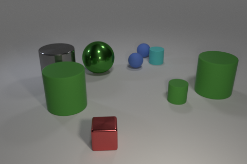

# Visually reasoning AI

[visuallyreasoningai.com](www.visuallyreasoningai.com)

Galvanize capstone project 11/02/2017

Motivation for this project was the fact that neural networks are pretty good at
recognizing objects, but what we really want them to do is to be able to reason
about visual information.

Look at this picture. It is pretty easy to answer to this question: Are there more balls than green things. But in reality you need to know a lot about this world to do it. You need to understand colors, shapes, be able to count and compare. And neural networks of general architecture are not able to do it.

I've build a model able to answer to logical questions to images like this. I used CLEVR diagnostic dataset. It consists of 100.000 images with 10 questions attached to each image. Dataset built in a way that over 835.000 questions are unique. If you want to learn more about CLEVR visit this [link](http://cs.stanford.edu/people/jcjohns/clevr/).

I was inspired by this research:

[FiLM: Visual Reasoning with a General Conditioning Layer (2017)](https://arxiv.org/abs/1709.07871)

I have built my model in Python using Pytorch framework.

On a high level architecture of the model looks like this:

It consists of two neural networks. Gated Recurrent Unit (GRU)network processes a question and its final hidden state is used as a conditional input to the Convolutional Neural Network, which takes image features and processes it through several (4 in this case) conditional blocks.

When I had built this model it turn out that original model needed around 72 hours of training to converge. To speed-up training I parallelized training of a single model on multiple GPUs and used varying learning rate . In the end I was able to run several experiments at a time and speeded-up training of a single model up to 50%.

It turn out that model architecture was pretty robust to my experiments and different variations of the model landed up with validation accuracy between 96 and 97 percent.

At this point I started to play with trained models and I found it to be really enjoyable. So I've built a web application where user can ask its own questions to the model.

App is available at  [visuallyreasoningai.com](www.visuallyreasoningai.com). Enjoy!
